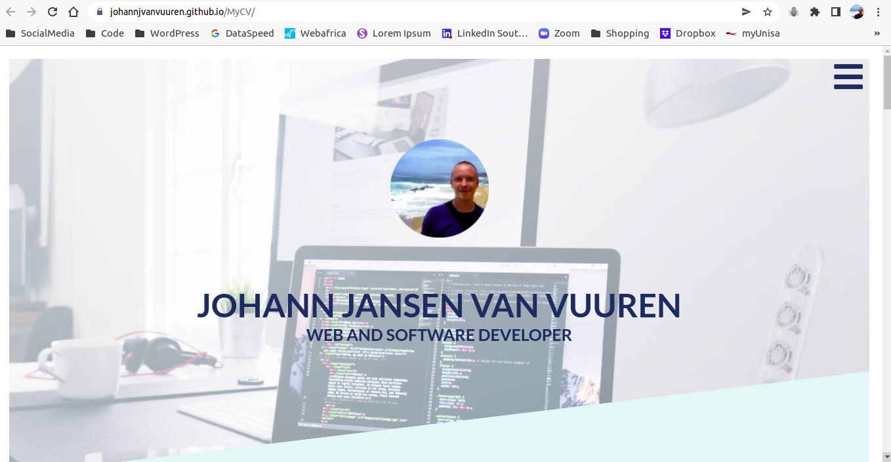

# MyCV

### 1. Introduction

This is a single "landing page" website that introduces the visitor to professional web profile of Johann Jansen van Vuuren. It serves as a virtual CV of sorts introducing the author and listing some professional biographical information.

The website was created as a portfolio project, forming part of the HyperionDev Immersive Full-Stack and Software Engineer Bootcamp. In addition to the above purpose, it is also an ongoing project to showcase the cumulative skill in HTML5, CSS3, JavaScript and other full stack web developemnt languages and skills, that has been built up during progression through the boot camp. 

## Index
1. Introduction
2. Installation
3. Usage
4. Credits

### 2. Installation

There are no special installation instructions for this project. The files can be downloaded as a ZIP file and extracted. The folder structure should be kept **exactly** how it is and the website can then be viewed by opening the `index.html` file.

It can alternatively also be accessed via the following [link](https://johannjvanvuuren.github.io/MyCV/).

### 3. Usage

As a single landing page website, it is very easy to use. You can either scroll through the website from top to bottom or click on the hamburger icon which will open a navigation menu to jump to the specific sections. This hamburger icon is fixed and is therefore visible in the top right hand corner of the page at all times.

The image below shows the hamburger icon:

.

### 4. Credits

This website was designed and conceived by Johann Jansen van Vuuren under the guidance of HyperionDev.
